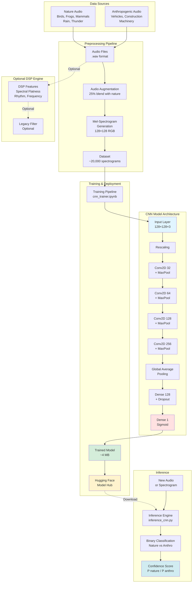

# 🌲 QuietHorizon

**Environmental Audio Classifier — Detecting Human Noise Intrusion in Natural Soundscapes**

QuietHorizon is a machine-learning system designed to identify anthropogenic (human-made) noise in nature recordings.
It supports environmental research, bioacoustics, and conservation work by enabling automated filtering of noisy audio.

## This repository contains:

- The CNN training pipeline
- Spectrogram generation
- Augmentation scripts
- Inference tools
- Link to the hosted pretrained model on Hugging Face

QuietHorizon is optimized for small-footprint inference (≈4 MB model) with strong performance:

| Metric    | Value  |
|-----------|--------|
| Accuracy  | ~95%   |
| AUC       | ~0.99  |
| Precision | ~0.95  |
| Recall    | ~0.96  |

## 🔍 Problem Statement

Natural soundscapes are increasingly polluted by human noise—vehicles, aircraft, construction, machinery—which interferes with wildlife monitoring and conservation research.

Existing classifiers (e.g., BirdNET) focus on species detection but not on detecting and filtering noise contamination.

**QuietHorizon fills that gap.**

## 🧠 Model Overview

QuietHorizon uses a binary CNN classifier trained on mel-spectrogram images generated from:

**Nature (negative class)**
- Clean species calls (birds, frogs, mammals)
- Pure natural ambience (rain, thunder)

**Anthropogenic (positive class)**
- Vehicle noise (road, plane)
- Construction noise (drills, saws)
- Mechanical systems
- Augmented audio blended with nature at 25% for robustness

## 🏗️ System Architecture



### CNN Architecture Details

A compact but effective model:

```
Input → Rescaling → Conv(32) → Pool
      → Conv(64) → Pool
      → Conv(128) → Pool
      → Conv(256) → Pool
      → GAP → Dense(128) → Dropout → Dense(1, sigmoid)
```

This yields a strong, generalizable classifier while maintaining a small on-disk size (~4 MB).

## 🤖 Pretrained Model

The trained CNN is available here:

👉 **Hugging Face**: https://huggingface.co/bbureau12/QuietHorizon

Load directly via:

```python
from huggingface_hub import hf_hub_download
import tensorflow as tf

model_path = hf_hub_download(
    repo_id="bbureau12/QuietHorizon",
    filename="quiet_horizon_cnn.keras"
)

model = tf.keras.models.load_model(model_path)
```

## 📦 Repository Structure

```
QuietHorizon/
│
├── frontend/                     # 🆕 Streamlit web application
│   ├── app.py                   # Main Streamlit app
│   ├── config.py                # Configuration settings
│   ├── requirements.txt
│   ├── utils/                   # Utility modules
│   │   ├── model_loader.py     # Model loading & caching
│   │   ├── audio_processor.py  # Audio processing pipeline
│   │   └── visualization.py    # Plotting utilities
│   └── components/              # UI components
│       ├── upload.py
│       ├── results.py
│       └── batch.py
│
├── cnn_generation/              # (cnn_training in README)
│   ├── cnn_trainer.ipynb
│   ├── audio_augmentation.py
│   └── generate_spectograms.py
│
├── dsp/                         # (optional legacy DSP filters)
│   ├── frequency.py
│   ├── rhythm.py
│   └── spectral_flatness.py
│
├── quiet_horizon/
│   └── inference_cnn.py         # CLI inference tool
│
├── dataset_cnn_specs/           # (not included in repo)
│
├── models/
│   └── quiet_horizon_cnn.keras  # <-- NOT committed. Hosted on HF.
│
└── README.md
```

## 🚀 Getting Started

### Option 1: Web Interface (Recommended) 🌐

The easiest way to use QuietHorizon is through the Streamlit web interface:

```bash
cd frontendtensorflow librosa numpy pillow huggingface-hub
```

#```

Or use the startup scripts:
- **Windows**: `run.bat`
- **Unix/Mac**: `./run.sh`

The web app provides:
- 🎵 Single file classification with visualizations
- 📦 Batch processing with CSV export
- 📊 Rich analytics and probability gauges
- 🔊 Audio playback and waveform display

See [frontend/README.md](../frontend/README.md) for detailed documentation.

### Option 2: Python API
#
#### 1. Install dependencies

```bash
python -m venv venv
source venv/bin/activate   # or venv\Scripts\activate on Windows
pip install -r requirements.txt
```

### 2. Run inference on a spectrogram

```bash
python inference/inference_cnn.py path/to/spectrogram.png
```

Example output:

```
Image: example.png
  P(nature) = 0.047
  P(anthro) = 0.953
  → Predicted: ANTHRO
```

### 3. (Optional) Train your own model

```bash
python cnn_training/train_cnn.py
```

This:
- Loads mel-spectrogram images
- Builds a TensorFlow CNN
- Trains with augmentation
- Saves best model as: `models/quiet_horizon_cnn.keras`

## 🧪 Dataset Summary

- ~20,000 labeled audio clips
- Spectrograms created at 128×128, 3-channel RGB
- Balanced via heavy augmentation of anthropogenic audio
- Natural species include ~70 MN wildlife categories
- Anthropogenic sounds include 10+ machine/environment categories

## 🛠️ Inference Script Example

(From `inference_cnn.py`):

```python
result = predict_image(model, "example.png")
print(result["pred_label"], result["prob_anthro"])
```

## 📊 Performance Notes

The CNN performs extremely well because:

- It learns shape and texture patterns in spectrograms
- Anthro signatures (engines, machinery, home improvement tools) have distinct harmonic structures
- Biological signals (birds, frogs, mammals) differ sharply in rhythm, pitch, and spectral flatness
- The resulting separation is robust even under augmentation.

## 🔮 Future Work

- WAV-to-spectrogram inference (no PNG needed)
- Multiclass classifier (road vs plane vs music vs home improvement)
- On-device model deployment (TensorFlow Lite)
- Noise suppression model using U-Net
- Hybrid DSP + CNN filter for scientific interpretability

## 📄 License

MIT License.